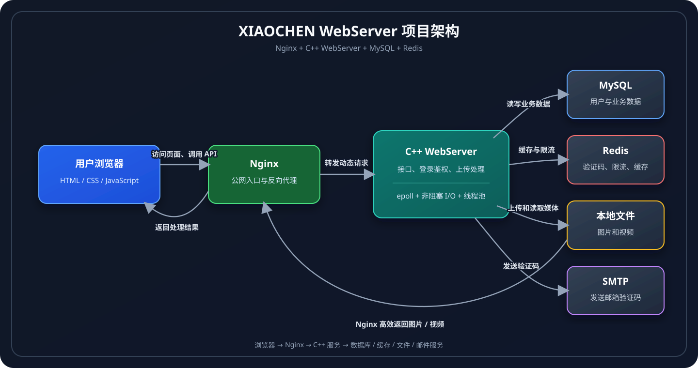

# XIAOCHEN WebServer

## 当前项目架构更新

当前部署推荐采用 **Nginx + C++ WebServer** 的前后分层架构：



```text
浏览器
  |
  v
Nginx :80
  |
  |-- /css/、/js/ 等公开静态资源由 Nginx 直接返回
  |-- /api/ 反向代理到 C++ WebServer :9006
  |-- /media/images/、/media/videos/ 先交给 C++ 校验登录态
      |
      v
    C++ 校验 Cookie Session
      |
      |-- 未登录：302 /login.html 或 401 JSON
      |-- 已登录：返回 X-Accel-Redirect
              |
              v
            Nginx internal alias 发送 public/images 或 public/videos 下的真实文件
```

核心分工：

- Nginx 负责入口流量、反向代理、静态资源发送、大图片和视频文件传输。
- C++ WebServer 负责登录注册、Session 鉴权、上传、图片/视频列表、媒体访问授权、MySQL 和 Redis 相关业务逻辑。
- 浏览器不再直接使用 `/images/...` 和 `/videos/...` 访问媒体文件，而是使用 `/media/images/...` 和 `/media/videos/...`。
- 真实文件仍保存在 `public/images/` 和 `public/videos/`。
- Nginx 通过 `/_protected_images/` 和 `/_protected_videos/` 的 `internal alias` 发送真实文件，外部用户不能直接访问这两个 internal 路径。

当前服务器参考路径：

```text
/var/www/codexhtml
```

Nginx 示例配置见：

```text
docs/nginx-x-accel-example.conf
```

重要提醒：

- 正式部署时应通过 `http://116.62.240.214/app.html` 访问，不要直接暴露或访问 `:9006`。
- C++ 服务建议只监听或仅允许本机 Nginx 访问 `127.0.0.1:9006`。
- 修改后端代码后，需要在 Linux 服务器 `/var/www/codexhtml` 下重新执行 `make` 并重启 `./build/server`。
- 修改 Nginx 配置后，需要执行 `sudo nginx -t` 和 `sudo systemctl reload nginx`。

## 已实现的关键能力

- 登录成功后由后端生成随机 Session Token，通过 `HttpOnly` Cookie 下发。
- Session 带过期时间，默认 2 小时，勾选记住登录后延长到 7 天。
- `/app.html`、`/video.html`、`/profile.html` 和受保护 `/api/*` 会统一校验登录态。
- `/api/images` 支持分页返回，前端滚动到底部继续加载。
- 图片库使用瀑布流布局和懒加载，减少首屏压力。
- 视频上传优先使用 2MB 分片上传，上传完成后后端合并为正式文件。
- 图片和视频访问走 `/media/...` 鉴权路径，通过后由 Nginx `X-Accel-Redirect` 发送文件。

XIAOCHEN WebServer 是一个基于 C++ 的轻量级 WebServer 示例项目，使用 Linux 网络编程模型实现静态资源访问、用户登录注册、邮箱验证码、图片上传和视频上传等功能。

## 功能特性

- 使用 `epoll` 处理 I/O 事件
- 使用线程池处理请求
- 支持静态文件访问和目录列表
- 支持登录、手机号注册、邮箱验证码校验
- 支持真实 SMTP 邮箱验证码发送
- 支持图片上传、图片列表和预览
- 支持视频上传和在线播放
- 使用 MySQL 保存用户账号信息
- 用户密码使用带盐哈希存储
- 使用 `alarm + SIGALRM + socketpair` 将定时器信号纳入 epoll 主循环，清理非活跃连接

## 项目结构

```text
.
├── src/                  # C++ 后端源码
│   ├── config/           # 命令行参数解析
│   ├── db/               # MySQL 连接池与用户表操作
│   ├── http/             # HTTP 请求解析
│   ├── mail/             # SMTP 邮箱验证码发送
│   ├── security/         # 密码哈希与验证
│   ├── server/           # WebServer 主体逻辑
│   ├── threadpool/       # 线程池
│   └── main.cpp          # 程序入口
├── public/               # 浏览器可访问的页面和静态资源
│   ├── css/
│   ├── js/
│   ├── images/
│   ├── videos/           # 上传视频保存目录
│   ├── login.html
│   ├── app.html
│   └── video.html
├── docs/                 # 补充说明文档
├── scripts/              # 本地启动脚本
├── config/local/         # 本地密钥配置，已被 git 忽略
└── Makefile
```

## 环境要求

项目依赖 Linux/WSL 环境，Windows 原生编译通常不可用。

需要安装：

- C++11 编译器，例如 `g++`
- MySQL 客户端开发库
- libcurl 开发库
- system crypt 支持

Ubuntu/WSL 示例：

```bash
sudo apt update
sudo apt install g++ make libmysqlclient-dev libcurl4-openssl-dev
```

如果系统缺少 `libcrypt` 开发包，可额外安装：

```bash
sudo apt install libxcrypt-dev
```

## 数据库准备

项目默认连接 MySQL 数据库 `qgydb`，用户表名为 `user`，核心字段：

```sql
CREATE TABLE IF NOT EXISTS user (
  username VARCHAR(64) NOT NULL PRIMARY KEY,
  passwd VARCHAR(255) NOT NULL
);
```

如果已有旧表，请确认密码字段长度足够保存哈希：

```sql
ALTER TABLE user MODIFY passwd VARCHAR(255) NOT NULL;
```

当前 `main.cpp` 中仍保留了演示用数据库账号配置，实际部署时建议改为环境变量或配置文件。

## SMTP 配置

邮箱验证码通过 SMTP 真实发送。启动服务前需要配置环境变量：

```bash
export XIAOCHEN_SMTP_URL="smtps://smtp.qq.com:465"
export XIAOCHEN_SMTP_USER="your_email@qq.com"
export XIAOCHEN_SMTP_PASSWORD="your_smtp_auth_code"
export XIAOCHEN_SMTP_FROM="your_email@qq.com"
export XIAOCHEN_SMTP_FROM_NAME="XIAOCHEN WebServer"
export XIAOCHEN_SMTP_LOGIN_OPTIONS="AUTH=LOGIN"
```

注意：`XIAOCHEN_SMTP_PASSWORD` 通常是邮箱服务商提供的 SMTP 授权码，不是邮箱登录密码。

更多说明见 [docs/SMTP_SETUP.md](docs/SMTP_SETUP.md)。

## 构建

```bash
make
```

或手动编译：

```bash
g++ -std=c++11 -pthread \
  -Isrc/config -Isrc/server -Isrc/http -Isrc/threadpool -Isrc/db -Isrc/mail -Isrc/security \
  src/main.cpp src/config/config.cpp src/server/webserver.cpp src/http/http_conn.cpp \
  src/threadpool/threadpool.cpp src/db/CGmysql.cpp src/mail/smtp_client.cpp \
  src/security/password_hasher.cpp -lmysqlclient -lcurl -lcrypt -o build/server
```

## 运行

```bash
./build/server -p 9006 -s 4 -t 8 -m 0
```

访问：

```text
http://localhost:9006/login.html
http://localhost:9006/app.html
http://localhost:9006/video.html
```

## 日志

服务会自动创建 `logs/` 目录：

- `logs/app.log`：运行日志，例如服务启动、登录、注册、重置密码、上传结果
- `logs/error.log`：错误日志，例如数据库连接失败、SMTP 发送失败、上传保存失败

写入日志前会自动脱敏密码、验证码、token、SMTP 授权码等敏感字段。日志文件已被 `.gitignore` 忽略，只保留 `logs/.gitkeep`。

## 命令行参数

```text
-p 监听端口
-l 日志写入模式，当前为保留字段
-m 触发模式
-o linger 配置
-s MySQL 连接池数量
-t 线程池线程数
-c 关闭日志标志，当前为保留字段
-a actor model 模式
```

触发模式：

```text
0: listen LT, conn LT
1: listen LT, conn ET
2: listen ET, conn LT
3: listen ET, conn ET
```

## 压力测试结果

压测脚本见 `scripts/bench-modes.sh`，详细说明见 `docs/STRESS_TESTING.md`。

本次测试环境：

```text
测试地址：http://127.0.0.1:9006
压测工具：wrk
压测参数：4 threads, 100 connections, 30s
测试接口：/login.html、/api/images?page=1&limit=12
测试时间：2026-05-25 23:31
```

结果汇总：

```text
模式  /login.html QPS  P99延迟   /api/images QPS  P99延迟   结论
0     12355.72         17.61ms   15249.97         14.01ms   基准模式，性能稳定
1     12184.15         17.63ms   15066.16         14.27ms   已恢复正常，和模式 0 接近
2     12314.92         17.25ms   15224.38         13.89ms   延迟略稳
3     12574.72         17.90ms   15765.47         13.45ms   当前综合吞吐最好
```

分析结论：

- `-m 0` 基准模式可正常工作，`/login.html` 约 1.24 万 QPS，P99 约 17.61ms。
- `-m 1` 修复后已恢复正常，`listen LT + conn ET` 不再出现 0 请求问题，整体表现和 `-m 0` 接近。
- `-m 2` 吞吐和 `-m 0` 接近，`/login.html` 的 P99 延迟在本次测试中最低。
- `-m 3` 当前综合表现最好，`/api/images` 达到约 1.58 万 QPS，P99 约 13.45ms。

当前建议默认使用：

```bash
./build/server -p 9006 -s 4 -t 8 -m 3
```

注意：这组结果是服务器本机 `127.0.0.1` 压测，主要用于比较 C++ WebServer 内部触发模式；公网访问、Nginx 反代、HTTPS、数据库写入、上传接口的真实性能需要单独压测。

## API 概览

登录注册：

```text
POST /api/login
POST /api/register
POST /api/send-email-code
POST /api/reset
```

`/api/reset` 使用手机号、邮箱验证码和新密码重置账号密码。当前用户表尚未保存邮箱字段，因此流程会校验手机号账号存在和邮箱验证码有效，但还不能校验邮箱是否绑定该手机号。

图片和视频：

```text
POST /api/upload
POST /api/upload-video
GET  /api/images
GET  /api/videos
```

上传视频会保存到 `public/videos/`，浏览器访问路径为 `/videos/文件名`。

## 安全说明

- 不要提交 `config/local/smtp.env`、`scripts/run_server.local.sh` 等本地密钥配置文件
- 不要提交编译产物 `build/server`
- 用户密码已改为带盐哈希存储，旧明文密码登录成功后会自动迁移为哈希
- SMTP 授权码泄露后应立即在邮箱服务商后台重新生成
- 当前项目仍为学习/演示项目，生产环境还应补充 HTTPS、请求限流、日志脱敏、账号邮箱绑定和更完整的输入校验

## 后续开发建议

- 将数据库连接信息、静态资源目录、上传大小限制等运行配置迁移到环境变量或配置文件
- 为用户表增加邮箱、创建时间、更新时间等字段，并校验手机号与邮箱绑定关系
- 增加数据库初始化 SQL 或轻量迁移脚本，避免部署时手动调整表结构
- 将用户相关 SQL 拼接逻辑改为参数化语句，降低输入边界和 SQL 注入风险
- 为验证码、登录、注册、找回密码和上传接口增加限流、失败次数限制与验证码尝试次数限制
- 将密码哈希升级为 Argon2id 或 bcrypt，并保留旧哈希迁移方案
- 强化登录态安全：会话过期、退出登录、Cookie 安全属性和简单 CSRF 防护
- 为上传文件增加 MIME 嗅探、随机存储名、访问权限控制、磁盘配额和清理任务
- 为视频播放补充 HTTP Range 请求支持，改善大视频拖动和断点加载体验
- 增加核心接口的 curl 验证脚本、自动化测试和 CI 构建检查
- 增加 HTTPS/反向代理、systemd 部署和 WSL/Linux 容器本地运行示例
- 为前端补充上传进度、加载状态、空列表状态、可重试错误提示和基础无障碍属性

## 相关文档

- [docs/SMTP_SETUP.md](docs/SMTP_SETUP.md)
- [docs/PASSWORD_HASHING.md](docs/PASSWORD_HASHING.md)
- [docs/STRESS_TESTING.md](docs/STRESS_TESTING.md)
